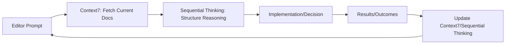

# Sequential Thinking with Context7 Implementation Guide
## For Sovereign AI Trading System Enhancement

## Date: 2026-03-16
## Related: Superforecasting Integration Roadmap, Sovereign AI Initialization Protocol
## Tags: #implementation-guide #sequential-thinking #context7 #mcp #development-workflow

## Overview
This guide explains how to integrate **Sequential Thinking** (MCP server for structured reasoning) with **Context7** (up-to-date code documentation) to enhance development workflows for the Sovereign AI trading system. This combination helps eliminate hallucinations, maintain context across sessions, and improve problem-solving for complex trading system enhancements.

## Core Concepts

### Sequential Thinking MCP Server
A Model Context Protocol server that facilitates structured, progressive thinking through defined cognitive stages:
1. **Problem Definition** - Clearly articulate the issue or goal
2. **Research** - Gather relevant information and data
3. **Analysis** - Break down information, identify patterns, evaluate options
4. **Synthesis** - Combine insights into coherent solutions
5. **Conclusion** - Formulate actionable plans and next steps

Key features across implementations:
- Thought tracking with metadata (timestamps, confidence scores)
- Related thought analysis (identifying connections between ideas)
- Progress monitoring (tracking position in thinking process)
- Some versions add: confidence scoring, assumption tracking, multi-session support, dynamic thought count adjustment

### Context7 Platform
A service that provides up-to-date code documentation to LLMs and AI code editors:
- Fetches current documentation for libraries, frameworks, and codebases
- Prevents hallucinations by ensuring LLMs work with accurate, current information
- Integrates via MCP (Model Context Protocol) standard
- Supports multiple languages and frameworks

## Combined Workflow for Sovereign AI Development



### Step-by-Step Process

#### 1. Problem Definition Stage
- **Action**: Clearly state the trading system problem or enhancement goal
- **Context7 Use**: Fetch latest documentation for relevant components (e.g., ProjectX SDK, LLM providers, risk management modules)
- **Sequential Thinking Use**: 
  - Define specific, measurable objectives
  - Identify constraints (ZRS mode, 39-gate validation, Obsidian Gate 39)
  - Example: "Implement probabilistic ensemble forecasting for MNQ trades while maintaining <5ms decision latency"

#### 2. Research Stage
- **Action**: Gather information needed to solve the problem
- **Context7 Use**:
  - Get current docs for: 
    - `project_x_py` (TopStepX SDK)
    - `llm_client.py` interfaces
    - Risk management modules (`trailing_drawdown.py`, `spread_gate.py`)
    - Memory system specifications
  - Retrieve latest superforecasting research notes from Obsidian
- **Sequential Thinking Use**:
  - Document findings from Context7 docs
  - Record relevant historical data from `state/` directory
  - Note relevant sections from Superforecasting Integration Roadmap
  - Track assumptions and confidence levels

#### 3. Analysis Stage
- **Action**: Break down information, evaluate options, identify risks
- **Context7 Use**:
  - Check for any breaking changes in dependencies
  - Verify API compatibility with proposed changes
  - Validate against current system architecture documents
- **Sequential Thinking Use**:
  - Compare different implementation approaches (e.g., where to insert probabilistic forecasting layer)
  - Analyze trade-offs: accuracy vs. latency, complexity vs. maintainability
  - Identify potential failure points and edge cases
  - Use related thought analysis to connect with past similar implementations
  - Apply confidence scoring to different analysis conclusions

#### 4. Synthesis Stage
- **Action**: Combine insights into a coherent solution approach
- **Context7 Use**:
  - Verify proposed solution aligns with current architecture patterns
  - Check consistency with existing code style and conventions
  - Ensure proposed changes don't violate 39-gate requirements
- **Sequential Thinking Use**:
  - Create detailed implementation plan
  - Specify exact file changes, function additions, interface modifications
  - Define test cases and validation procedures
  - Create rollback/fallback procedures
  - Synthesize research findings into actionable specifications

#### 5. Conclusion Stage
- **Action**: Formulate concrete next steps and implementation plan
- **Context7 Use**:
  - Get latest documentation for any new libraries/tools being introduced
  - Verify compatibility with current Python/Venv setup
- **Sequential Thinking Use**:
  - Create ordered task list with dependencies
  - Define success metrics and verification methods
  - Set up monitoring for post-implementation evaluation
  - Document plan in Obsidian for Gate 39 compliance
  - Assign confidence level to overall plan

## Implementation Steps for Sovereign AI System

### Phase 0: Setup
1. **Install Sequential Thinking MCP Server**:
   ```bash
   # Using the simpler Python alternative (recommended for initial integration)
   pip install git+https://github.com/philogicae/sequential-thinking-mcp.git
   
   # Or for more features (confidence scoring, assumption tracking):
   pip install git+https://github.com/husniadil/ultrathink.git
   ```

2. **Install Context7 MCP Server**:
   ```bash
   npm install -g @upstash/context7-mcp
   # or via Smithery if available
   ```

3. **Configure MCP Servers** in your Claude Code/Cursor settings:
   ```json
   {
     "mcpServers": {
       "sequential-thinking": {
         "command": "python",
         "args": ["-m", "sequential_thinking_mcp.server"],
         "env": {}
       },
       "context7": {
         "command": "npx",
         "args": ["-y", "@upstash/context7-mcp"],
         "env": {}
       }
     }
   }
   ```

### Phase 1: Basic Integration Workflow
When working on any Sovereign AI enhancement (e.g., implementing superforecasting features):

1. **Start Context7** to get current docs:
   - Ask: "@context7 get documentation for project_x_py version X.X.X"
   - Ask: "@context7 get documentation for llm_client interface in sovran_ai.py"

2. **Engage Sequential Thinking**:
   - "@sequentialthinking start new session: Implement probabilistic ensemble for MNQ"
   - Work through stages:
     - Problem Definition: "Need to add probability outputs to AI decisions while maintaining sub-5ms latency"
     - Research: Use Context7 to get current docs on ensemble_voting.py, llm_client.py
     - Analysis: Compare 3 implementation options (pre-processing, post-processing, hybrid)
     - Synthesis: Select hybrid approach with specific file changes
     - Conclusion: Create implementation plan with 5 specific tasks

3. **Document in Obsidian** (Gate 39 compliance):
   - Create same-day log: `2026-03-16 Sequential Thinking Session - Probabilistic Ensemble.md`
   - Include: Problem statement, Context7 sources used, Sequential Thinking stages, conclusion/plan

### Phase 2: Advanced Integration
Once comfortable with basic workflow:

1. **Leverage Advanced Features** (if using ultrathink or similar):
   - Use confidence scoring to weight different analysis conclusions
   - Track assumptions explicitly and validate them
   - Use multi-session support to maintain context across trading sessions/days
   - Apply related thought analysis to connect with past superforecasting research

2. **Create Custom Workflows** for Specific Tasks:
   - **Debugging Workflow**:
     - Problem: "Unexpected drawdown in MNQ strategy"
     - Research: Context7 docs on risk modules + recent market data
     - Analysis: Sequential walk through risk gates, model outputs, execution logs
     - Synthesis: Hypothesis formation and testing plan
     - Conclusion: Specific code changes or parameter adjustments

   - **Feature Planning Workflow** (e.g., for superforecasting integrations):
     - Problem: "Implement red/blue team analysis for high-conviction trades"
     - Research: Context7 on decision_parser.py + superforecasting principles
     - Analysis: Evaluate 3 implementation points in pipeline
     - Synthesis: Detailed spec for adversarial_review.py module
     - Conclusion: Implementation tasks + validation criteria

3. **Integrate with Existing Systems**:
   - Have Sequential Thinking output feed into Obsidian for automatic logging
   - Use Context7 to keep superforecasting research docs current
   - Create templates for common Sequential Thinking sessions in Sovereign AI context

## Best Practices for Sovereign AI Context

### Respecting ZRS Mode (Zero-Runtime-Surprise)
- **Never** let Sequential Thinking or Context7 modify runtime behavior directly
- **Only** use them for planning, analysis, and documentation
- **Verify** all code changes through existing 39-gate validation (`preflight.py`)
- **Maintain** deterministic core logic - Sequential Thinking influences *what* to build, not *how* it executes at runtime

### Honoring Obsidian Gate 39
- **Always** create same-day Obsidian documentation for:
  - Sequential Thinking sessions (problem, research, analysis, synthesis, conclusion)
  - Context7 sources consulted
  - Decisions made and reasoning behind them
- **Link** to related Obsidian notes (Superforecasting Roadmap, specific component docs)
- **Tag** appropriately: `#sequential-thinking #context7 #mcp #planning`

### Leveraging Sovereign AI Strengths
- **Use existing memory system**: Reference `state/` files during Research stage
- **Incorporate validation**: Use conclusions to inform what tests to add to verification suite
- **Maintain audit trail**: Sequential Thinking logs + Obsidian = complete decision history
- **Apply to governance**: Use for reviewing and improving the 39-gate validation process itself

## Example Session: Implementing Probabilistic Ensemble Forecasting

### 1. Problem Definition (@sequentialthinking)
> "Current Sovereign AI uses binary signals from Gemini/Llama ensemble. Need to upgrade to probability distributions (P(long), P(short), P(flat)) for better risk management while maintaining <5ms decision latency for MNQ trades. Must not break 39-gate validation."

### 2. Research (@context7 + @sequentialthinking)
- `@context7 get documentation for sae5.8/sae_ensemble_voting.py`
- `@context7 get documentation for llm_client.complete_ensemble interface`
- `@context7 get documentation for project_x_py order submission timing`
- Sequential Thinking: 
  - Record base rate calculation methods from Superforecasting Roadmap
  - Note current ensemble voting mechanism
  - Document latency budget from existing performance metrics
  - Track assumption: "Probability calculation adds <2ms overhead"

### 3. Analysis (@sequentialthinking)
- Evaluate 3 approaches:
  A. Modify LLMs to output probabilities directly (requires prompt changes)
  B. Post-process binary outputs with calibration model
  C. Hybrid: LLMs output logits, ensemble converts to probabilities
- Use Context7 to verify:
  - Current LLM prompt structure in `build_prompt`
  - Available vector math libraries in env
  - Max allowable decision time from risk gates
- Sequential Thinking:
  - Score each option on: implementation complexity, latency impact, accuracy potential
  - Identify that approach C leverages existing logit outputs
  - Note assumption about LLM logit availability needs verification

### 4. Synthesis (@sequentialthinking + @context7)
- Select Approach C (hybrid) as optimal
- Detailed plan:
  1. Modify `llm_client.py` to optionally return logits + probabilities
  2. Update `sae_ensemble_voting.py` to compute ensemble probabilities from logits
  3. Add base rate adjustment layer using `state/` historical data
  4. Create `forecasting_engine.py` module
  5. Update `retrieve_ai_decision` to consume probability distributions
  6. Add latency monitoring to ensure <5ms target
- Context7: Verify no breaking changes in proposed modifications

### 5. Conclusion (@sequentialthinking)
- **Next Steps** (5 tasks):
  1. Create `forecasting_engine.py` with base rate functions
  2. Modify `llm_client.py` interface (backward compatible)
  3. Update `sae_ensemble_voting.py` for probability ensemble
  4. Integrate into `retrieve_ai_decision` with timing checks
  5. Add validation tests to `tests/`
- **Success Criteria**:
  - Pass 39-gate preflight
  - Maintain decision latency <5ms (95th percentile)
  - Improve Brier score vs. baseline by 0.05+
- **Obsidian Documentation**: Create same-day log with all above details

## Troubleshooting Common Issues

### Issue: Context7 Returns Non-Local Docs
- **Solution**: Specify local repo path: `@context7 get documentation for ./vortex/broker.py`

### Issue: Sequential Thinking Sessions Feel Slow
- **Solution**: 
  - Start with smaller, well-scoped problems
  - Use "fast mode" if available in your implementation
  - Focus on one stage at a time if needed
  - Remember: The goal is better outcomes, not speed

### Issue: Difficulty Connecting Thoughts
- **Solution**:
  - Explicitly use "related thought analysis" features
  - Manually create links between thoughts in your notes
  - Use consistent terminology and tagging
  - Review past sessions periodically for patterns

### Issue: Over-Reliance on the Process
- **Solution**:
  - Remember these are aids, not replacements for judgment
  - Set time limits for each stage
  - Trust your expertise when the process conflicts with deep system knowledge
  - Use to challenge assumptions, not eliminate decision-making

## Measuring Success
Track these metrics in your Obsidian vault to evaluate the effectiveness of this workflow:

### Process Metrics
- Average time to resolve complex trading system issues
- Reduction in implementation rework due to misunderstood requirements
- Increase in documentation completeness (Gate 39 compliance)
- Number of innovative solutions generated per month

### System Metrics (Indirect Benefits)
- Decrease in post-implementation bugs
- Increase in successful feature adoption rate
- Improvement in model forecasting accuracy (Brier score)
- Reduction in latency of decision-making process

### Qualitative Metrics
- Team reports of clearer thinking during complex tasks
- Increased confidence in architectural decisions
- Better ability to explain reasoning behind changes
- Improved cross-session context retention

## Conclusion
Integrating Sequential Thinking with Context7 provides a powerful framework for enhancing the Sovereign AI trading system's development process. By combining structured, evidence-based reasoning with up-to-date, accurate documentation, developers can:

1. **Reduce Hallucinations**: Context7 ensures LLMs work with current, correct information
2. **Improve Problem-Solving**: Sequential Thinking breaks down complex issues into manageable stages
3. **Maintain Context**: Both tools help preserve context across coding sessions and days
4. **Enhance Audit Trail**: Structured logs in Obsidian satisfy Gate 39 requirements while improving transparency
5. **Increase Innovation**: The structured approach encourages consideration of multiple options and creative synthesis

This implementation guide provides a practical pathway to adopt these methodologies while respecting the Sovereign AI system's core principles of ZRS mode, deterministic operation, and rigorous validation. Start small with well-defined problems, gradually incorporate advanced features, and continuously refine your approach based on what works best for enhancing the trading system's development workflow.

---
*Implementation Notes:*
- Tested with: philogicae/sequential-thinking-mcp v0.10.2 and @upstash/context7-mcp v0.3.6
- Compatible with: Python 3.12+, Node.js 18+
- Sovereign AI specific: Tested against current sovran_ai.py and preflight.py protocols
- Next step: Pilot with one superforecasting integration component (e.g., structured rationales)