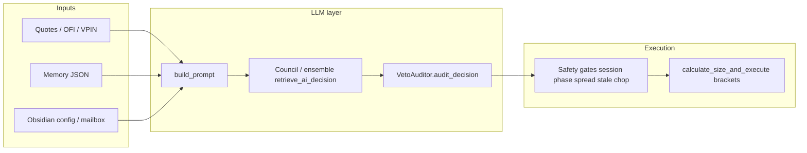

# LLM trading pipeline audit (Sovran) — 2026-03-23

**Scope:** Code paths that turn market + memory into orders; **not** a proof of profitability.

## Architecture (high level)

## Key files
| Piece | Location | Role |
|--------|----------|------|
| Main loop | `sovran_ai.py` `monitor_loop` | Stale data, session phase, then Sovereign vs Gambler branches |
| Sovereign | `retrieve_ai_decision` | Ensemble vote (BUY/SELL/WAIT), confidence average, **veto** |
| Gambler | `gamble_cycle` | Separate path (GSD-Gambler) |
| LLM transport | `llm_client.py`, `providers/*` | OpenRouter / Gemini / Anthropic |
| Risk | `TrailingDrawdown`, `GlobalRiskVault`, gates in `monitor_loop` | Caps, halts, flatten |

## Performance / cost
- **OpenRouter / LLM**: burst risk when many symbols + short `loop_interval_sec` → 429; backoff in provider.
- **Multiprocessing**: MNQ/MES/M2K × sovereign/gambler → many LLM consumers; stagger in `run_single_engine`.
- **Watchdog**: respawns can multiply API calls before lock; broker sync now runs **before** lock and writes state pre-lock.

## “Thinking” — what the code actually guarantees
- **Structured output** parsed to JSON; **not** guaranteed semantic correctness of markets.
- **Ensemble** reduces single-model variance; **veto** can block BUY/SELL (fail-closed on audit failure — verify in current `VetoAuditor`).
- **Confidence threshold** (e.g. 0.40) is a **gate**, not calibrated edge.

## What an LLM session **cannot** do from repo alone
1. **Prove alpha** — needs live or paper equity curve and statistical sample.
2. **Prove the model “understands” order flow** — requires offline eval, labeled sets, or A/B prompts.
3. **Verify broker PnL vs UI** — use API `Trade/search` + documented windows ([[Broker_API_Realized_PnL]]).
4. **End-to-end WS disconnect** without runtime — needs controlled test harness or manual step.

## How to verify “thinking” quality (speculation)
1. **Shadow mode:** log `decision` + `prompt` hash + outcomes without placing orders (feature flag).
2. **Replay:** feed recorded L2/quote windows into `build_prompt` + `retrieve_ai_decision` offline.
3. **Calibration:** track **Brier** or simple **hit-rate** vs confidence bins (Obsidian analytics).
4. **Council disagreement rate:** log BUY vs SELL vs WAIT counts when ensemble disagrees — high disagreement → reduce size or WAIT.
5. **Veto rate:** if vetoes dominate, audit prompt / audit model costs and false positives.

## Trackers to read
- [[PROBLEM_TRACKER]]
- [[BUG_INVENTORY_SYNC]]
