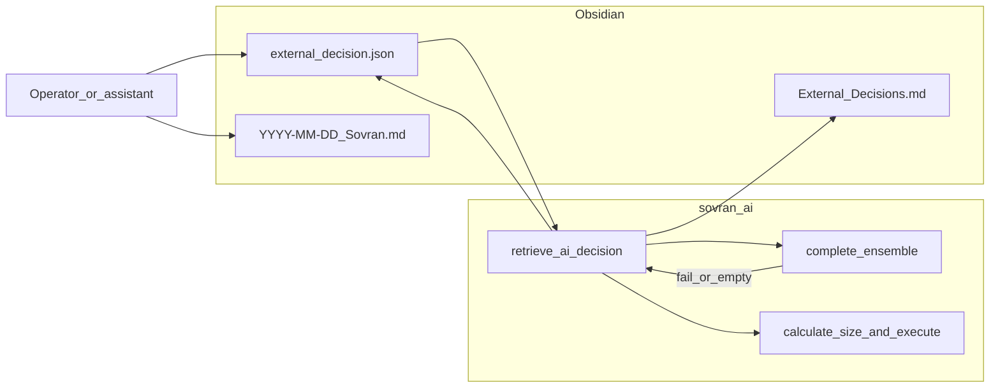

# Stand-in plan, status, and work completed (2026-03-23)

**Purpose:** Single vault source for the Cursor plan *Stand-in status and playbook* (`stand-in_status_and_playbook_8407d5aa.plan.md` in `.cursor/plans/`) plus what was implemented in code and docs.

**Related:** [[Protocols/LLM_TRADER_PROTOCOL]], [[Architecture/Trading_Halt_Sources]], [[Bugs/PROBLEM_TRACKER]], [[2026-03-23_OpenRouter_Migration]]

---

## Overview (from plan)

- Path C (**external LLM stand-in**) is **implemented** in the repo.
- Remaining operational work: **verification** (preflight, monitor, optional forced ensemble-failure test).
- Plan iterations covered: **autonomous approval** (session-level env), **intelligent risk** (existing layered gates + optional future composite score), **unattended execution** (watchdog + `sovran_ai`, not chat).
- **No guaranteed profit.** Intelligent risk = deterministic gates + `VetoAuditor`, not omniscience.

---

## What was implemented (done)

| Area | What | Location |
|------|------|----------|
| External decision | Load/validate JSON, expiry, archive, journal append | `C:\KAI\armada\sovran_external_decision.py` |
| Engine wiring | `retrieve_ai_decision`: pre-ensemble when not fallback-only; fallback on empty council / timeout / error; `_finalize_external_stand_in` + optional veto | `C:\KAI\armada\sovran_ai.py` (~1421–1605) |
| Env | `SOVRAN_EXTERNAL_DECISION_ENABLED`, `SOVRAN_EXTERNAL_DECISION_PATH`, `SOVRAN_EXTERNAL_FALLBACK_ONLY`, `SOVRAN_EXTERNAL_BYPASS_VETO`, `SOVRAN_OBSIDIAN_VAULT`, `SOVRAN_EXTERNAL_DEFAULT_TTL_SEC` | Same + `.env.example` |
| Vault template | Example JSON (no secrets) | `TradingIntents/external_decision.EXAMPLE.json` |
| Protocol | Path C + API outage checklist | `Protocols/LLM_TRADER_PROTOCOL.md` |
| P1 | Optional second log file | `SOVRAN_EXTRA_LOG_PATH` in `sovran_ai.py` |
| P2 | Dev second instance | `--ignore-singleton-lock` + `SOVRAN_ALLOW_MULTI_INSTANCE` |
| P3 | Trade batch noise | Verified `GatewayTrade` batch at **debug** only (`market_data_bridge.py`) |
| P4 | Halt sources map | `Architecture/Trading_Halt_Sources.md`; PROBLEM_TRACKER P4 mitigation link |
| OpenRouter | Defaults (`consensus_models`, `audit_model`), `sk-or-` startup branch | `sovran_ai.py` |
| Monitor | OpenRouter health when provider/key indicates OpenRouter | `monitor_sovereign.py` |
| Diagnostics | OpenRouter ping script | `C:\KAI\armada\diag_openrouter_ping.py` |
| Journal on consume | `Journal/External_Decisions.md` when a stand-in file is consumed | Written by `sovran_external_decision.append_journal` |

**Verification milestone (reported):** `python preflight.py` → **ALL CLEAR (45/45)** on a prior run; re-run after env changes.

---

## Plan todos still pending (operator / optional code)

From plan frontmatter — not all require code:

- Run `preflight.py` + `monitor_sovereign.py --once` (OpenRouter line).
- Optional: force ensemble failure + valid `external_decision.json` → confirm `[EXTERNAL]` logs + `External_Decisions.md`.
- Optional vault: tighten `LLM_HANDOFF_LATEST` if any Gemini-primary wording remains.
- Optional protocol: explicit pre-append daily journal before Path C vs `SOVRAN_EXTERNAL_AUTO_APPROVED` (not implemented in code yet).
- Optional: stand-in **feed** script / Task Scheduler refreshing `external_decision.json` (rate limits, kill switch).
- Optional: **risk-intelligence** doc pass (map all gates in `sovran_ai`).
- Optional: **composite risk score** hook (block/downsize + env thresholds).

---

## Autonomous approval (summary)

- Sovran does **not** prompt per trade for Path C; enabling `SOVRAN_EXTERNAL_DECISION_ENABLED=1` for the process is **session-level** acceptance.
- `SOVRAN_EXTERNAL_FALLBACK_ONLY=1` (default): file used when ensemble fails / empty / timeout / error.
- Pre-ensemble override: `SOVRAN_EXTERNAL_FALLBACK_ONLY=0` (use with care + optional feed).
- Full auto without veto LLM: `SOVRAN_EXTERNAL_BYPASS_VETO=1` (dangerous).

---

## Intelligent risk + unattended (summary)

**Already in engine:** stale/spread/phase/micro-chop guards, OFI/VPIN context, daily and trailing limits, sizing, ensemble + **VetoAuditor**, external stand-in through same veto unless bypassed.

**Gap (optional future):** single **composite risk score** + downsize before brackets — plan todo `optional-risk-composite`.

**Unattended:** `sovran_ai` + **watchdog** on a stable PC; broker connectivity required; monitor logs / `SOVRAN_EXTRA_LOG_PATH` for diagnosis.

---

## Finish checklist (from plan)

1. `python preflight.py` from `C:\KAI\armada` — expect ALL CLEAR.
2. `python monitor_sovereign.py --once` — LLM health line matches OpenRouter when configured.
3. Optional forced stand-in test: bad model or network → ensemble fails → valid `external_decision.json` → `[EXTERNAL]` in logs + journal.
4. Optional: session log / handoff if Gemini still referenced as primary anywhere.

---

## Security

Do not paste API keys into chat or commit them. Rotate exposed keys; keep secrets in local `.env` only.

---

## Diagram (Path C flow)

